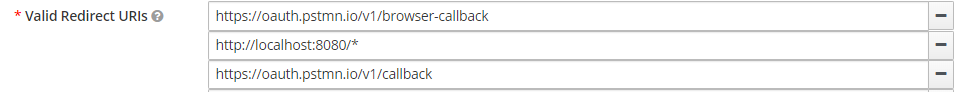

# Тестовое задание на позицию Junior Java разработчика
## Разработка Системы Управления Задачами
### Описание задачи:
Вам необходимо разработать простую систему управления задачами (Task
Management System) с использованием Java. Система должна обеспечивать создание,
редактирование, удаление и просмотр задач. Каждая задача должна содержать
заголовок, описание, статус (например, "в ожидании", "в процессе", "завершено") и
приоритет (например, "высокий", "средний", "низкий"), а также автора задачи и
исполнителя. Реализовать необходимо только API.
Требования:
1. Сервис должен поддерживать аутентификацию и автризацию пользователей по
email и паролю.
2. Доступ к API должен быть аутентифицироват с помощью JWT токена.
3. Пользователи могут управлять своими задачами: создавать новые,
редактировать существующие, просматривать и удалять, менять статус и
назначать исполнителей задачи.
4. Пользователи могут просматривать задачи других пользователей, а
исполнители задачи могут менять статус своих задач.
5. К задачам можно оставлять комментарии.
6. API должно позволять получать задачи конкретного автора или исполнителя, а
также все комментарии к ним. Необходимо обеспечить фильтрацию и
пагинацию вывода.
7. Сервис должен корректно обрабатывать ошибки и возвращать понятные
сообщения, а также валидировать входящие данные.
8. Сервис должен быть хорошо задокументирован. API должнен быть описан с
помощью Open API и Swagger. В сервисе должен быть настроен Swagger UI.
Необходимо написать README с инстуркциями для локального запуска
проекта. Дев среду нужно поднимать с помощью docker compose.
9. Напишите несколько базовых тестов для проверки основных функций вашей
системы.
10. Используйте для реализации системы язык Java 17+, Spring, Spring Boot. В
качестве БД можно использовать PostgreSQL или MySQL. Для реализации
аутентификации и авторизации нужно использовать Spring Security. Можно
использовать дополнительные инсрументы, если в этом есть необходимость
(например кэш).

# Решение
Приложение использует OAuth2 авторизацию при помощи сервера авторизации Keycloak.

В репозитории настроено автоматическое исполнение тестов на событие **push**, **pull request** в ветки **main** и **dev**

## Запуск dev среды
Для запуска нужно выполнить команду:
```shell
$ docker compose -f .\devops\docker-compose.yml up -d 
```
После исполнения поднимется БД приложения, сервер авторизации Keycloak, БД Keycloak 
и само приложение (будет произведена компиляция из исходного кода).

## Документация
После запуска Swagger-документация будет доступна по URL
`http://localhost:8081/api/v1/swagger-ui/index.html`

Сервер авторизации Keycloak будет доступен по URL
`http://localhost:8080/`
## Параметры сервера авторизации
Сервер авторизации допускает регистрацию, использует Email в качестве логина пользователей.
Для получения токенов использовался Postman и были настроены следующие redirect uris:

Client id: `tasks`

Client secret: `jmtcYS7XOgMDllK8SwLh2VFBxJtWgiaC`
## Список использованных технологий
- Java 17
- Spring boot
  - Data JPA
  - MVC
  - Security
- Liquibase
- Hibernate validator
- Docker compose
- Keycloak
- GitHub Actions
- PostgreSQL
